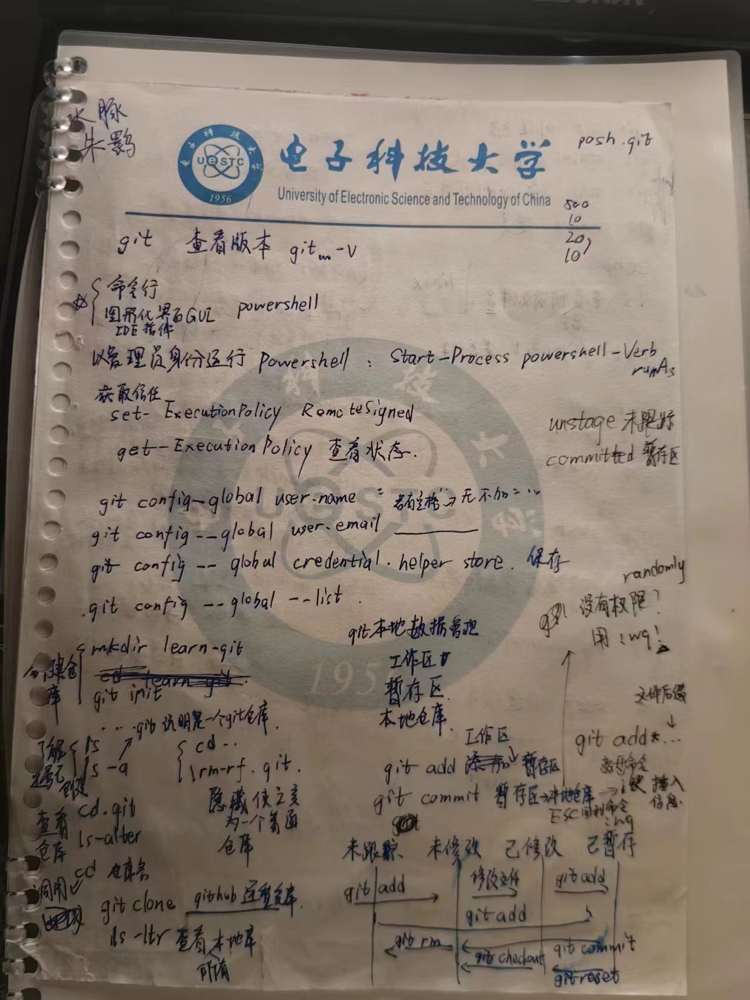
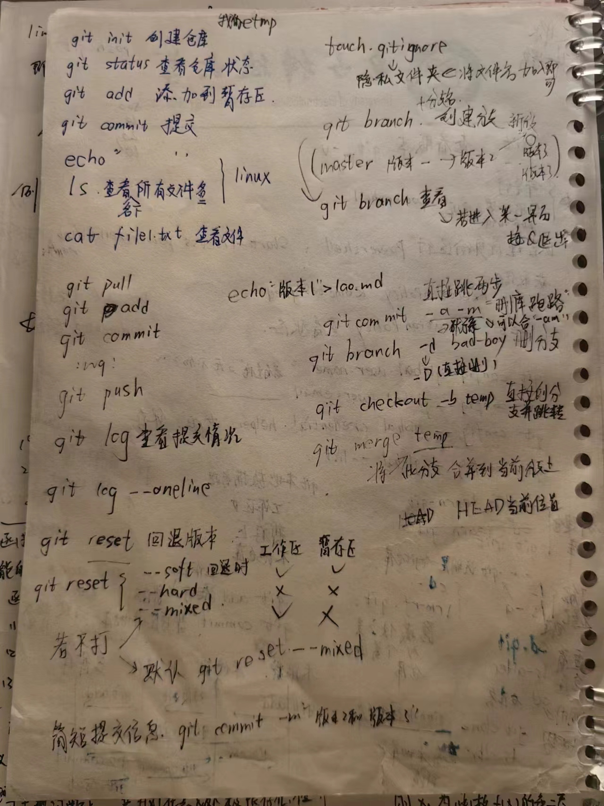
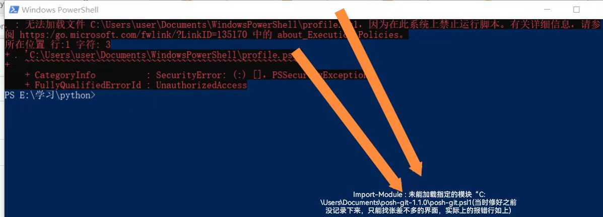
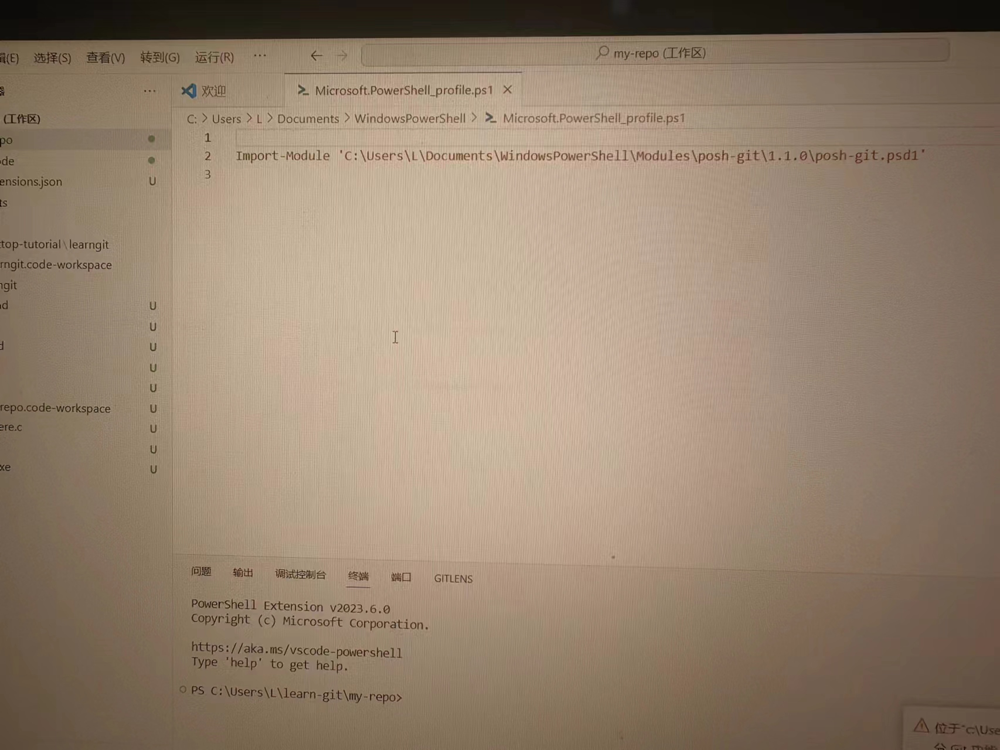
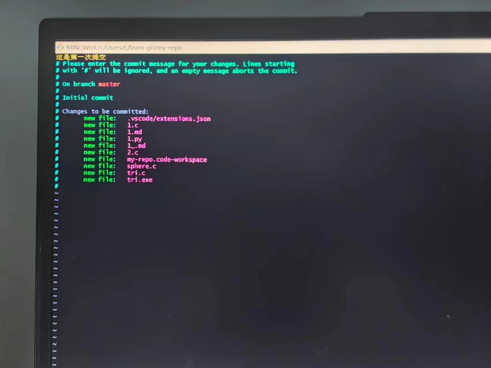
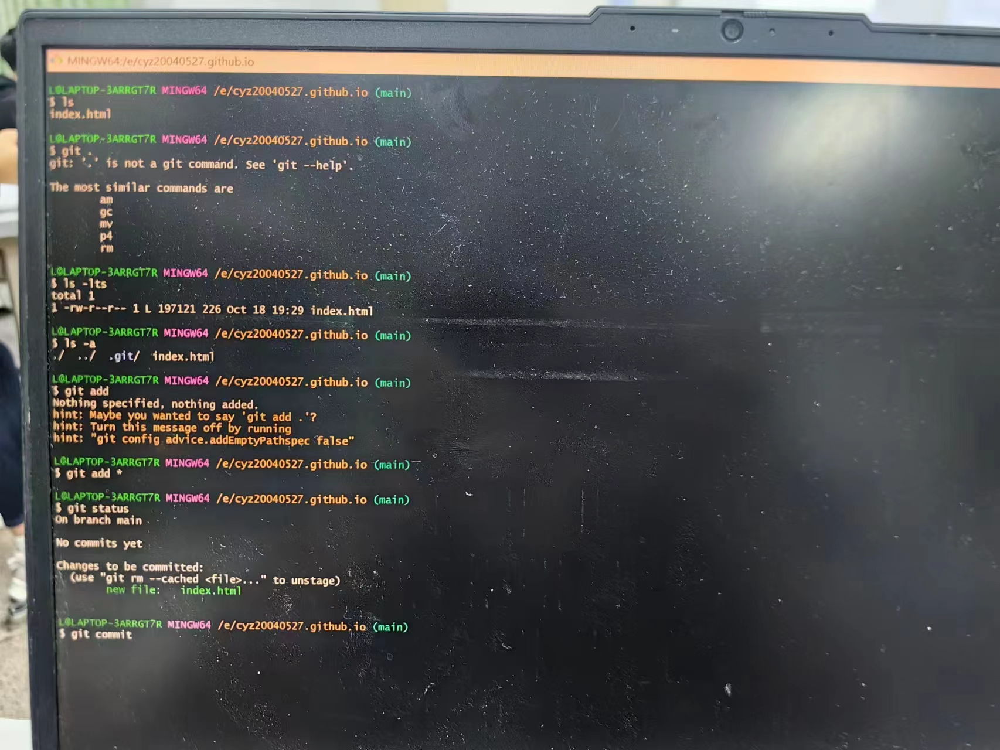
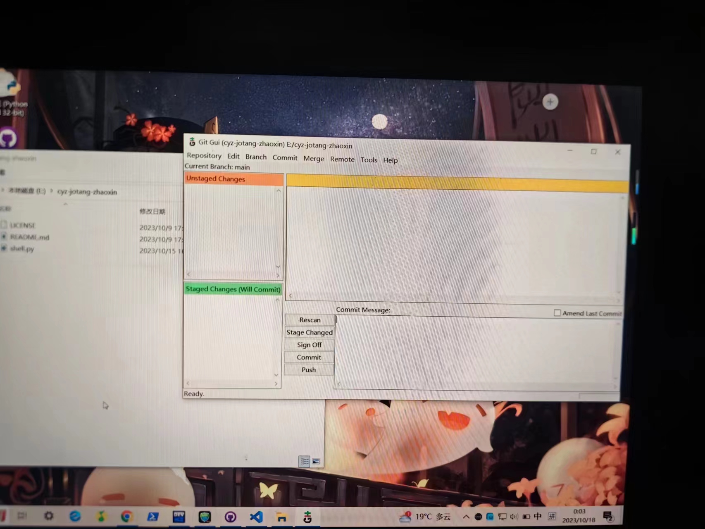
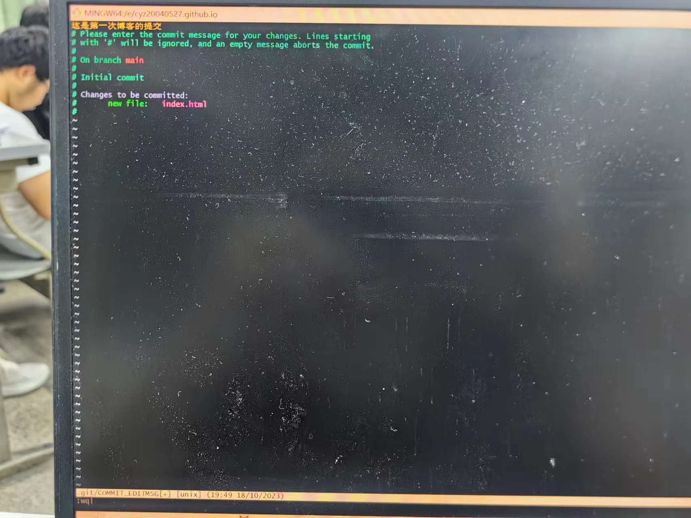
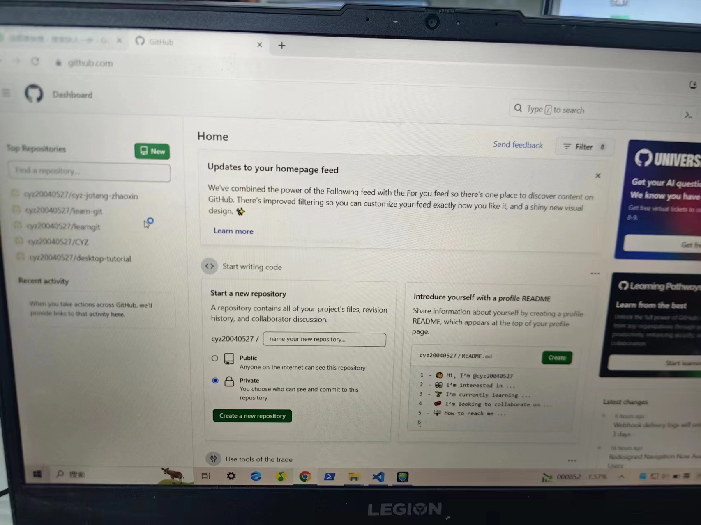
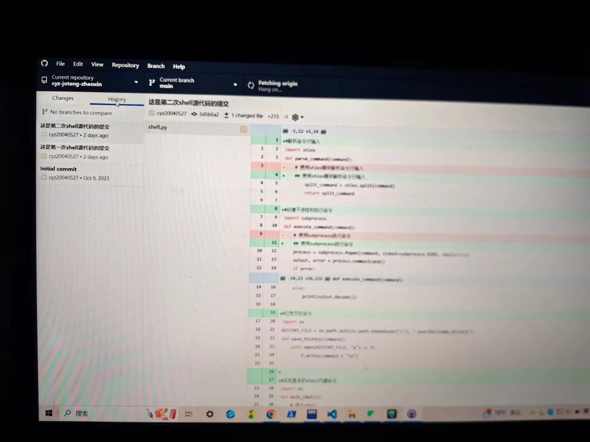

#**和git的共同回忆**

######零.前言

jotang招新的长征眨眼间就快走到了尽头，蓦然回首，才发现git以及和他有关的一切都已经成为了我最好的帮手（深情ing）(Markdown你也是o-o)
***
##一.学习git

跟着教程里的老师学，也认真做了笔记呢。（上图！）

学完感觉充满了力量（OvO），似乎半只脚要快踏入新天地了，下面就开始实践...
***
##二.使用git

####1.首先就是安装git（信心满满）
顺便装了一个posh-git，然后powershell就变成了奇怪的形状了呢（悲）
如图所示：

科学上网ing...

终于————（怪叫）我了解到要通过修改Microsoft.PowerShell-profile.psl1文件中的路径就ok啦（喜）
如图所示：

####2.git,启动

上图：

但是还是遇到了问题o.0?
在git commit时用“：wq”无法成功commit
再次科学上网？加了一个“！”就行了！

已经能熟练运用git bash和git gui了(>.<)
（有好多命令就不显示啦）

####3.github来喽
小曹很快获得了自己的GitHub账号并且建立了好几个远程仓库呢。
（我的焦糖招新仓库链接：***https://github.com/cyz20040527/cyz-jotang-zhaoxin***）
（博客也建好了，但里面什么都没有（哭）***https://cyz20040527.github.io***）
已经能顺利完成各种提交操作了O-O！

而且github desktop真的有用（~ 0.0）~上传下载真的很顺滑

***
##三.结语
git之旅让小曹收获了很多！对以后我的工作中和团队的合作更加省力和方便。（感谢jotang）
######题外话
相比于git的图形化界面，我还是更喜欢命令行呢，毕竟很有小黑客的感觉（>-<）

